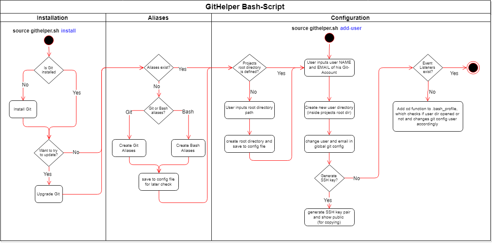

# GitHelper Bash-Script
The GitHelper Bash-Script supports users working with Git in their local environment.   
It handles the Git installation and configuration. Once the script run through, your local environment will be all set for working efficiently with git.

## Overview
- Preconditions
- How to run the script
- Structure
- Installation
- Aliases
- Configuration

## Preconditions
For running this script in your local system you need the following: 
- Operating System: Linux (f.e. Debian)
- Administrator permissions (sudo)
- To use Git you are going to need an Account [GitHub](https://github.com/)

## How to run the script
The script installs the needed packages and edits environment variables. That is why it needs to be sourced. 
  
`source githelper.sh install`  
or   
`source githelper.sh add-user`

If you run the script without any argument, it will show you the possible arguments.  
The script uses `sudo` for certain commands, so you will be asked to enter your password.

## Structure
The script checks and configures all needed parts of Git.  
What steps are done and in which order visualizes the following flow chart.    

  
  
All the different stages of the script are described and explained in the following chapters. 

## Installation
1. Check if Git is installed and install it if not
2. Ask user if git upgrade should be tried. Try upgrade git if answer is Yes. 

## Aliases
Ask the user if Git or Bash aliases should be created. If the user wants to create git aliases, the optional alias for git (g) can be created.   
Git alias example: `git config --global alias.in init`  
Bash alias example: `alias gin='git init'` 

Here a list of all creating aliases: 

| Alias | Git Command | Description | 
|:------|:------|:------|
| `g` | `git` | [ optional ] Bash Alias for every git command (all following commands can be called like following: `g command`) |
| `conf-name` | `git config --global user.name` | Configure the author name to be used with your commits |
| `conf-email` | `git config --global user.email` | Configure the email address to be used with your commits |
| `in` | `git init` | Create a new local repository |
| `cl` | `git clone` | Create a working copy of a local/remote repository |
| `co` | `git checkout` | Switch from one branch to another |
| `cob` | `git checkout -b` | Create a new branch and switch to it |
| `rao` | `git remote add origin` | Connect your local repository to a remote server, add the server to be able to push to it |
| `st` | `git status` | List the files you've changed and those you still need to add or commit |
| `a` | `git add` | Add one or more files to staging |
| `aa` | `git add -A` | Add all changed files to staging |
| `cm` | `git commit -m` | Commit all added changes to HEAD (but not yet to the remote repository) |
| `ac` | `!git add -A && git commit` | Add all changed files to staging and directly commit changes with message |
| `pu` | `git push` | Send all committed changes to your remote repository |
| `puo` | `git push -u origin` | Push the branch to your remote repository, so others can use it |
| `brd` | `git branch -d` | Delete the feature branch |
| `brD` | `git branch -D` | (Hard-)Delete the feature branch |
| `rbm` | `git rebase origin/master` | Rebase your current branch with origin/master |
| `frbm` | `git fetch origin master && git rebase origin/master` | Fetch newest master version and rebase your current branch with origin/master |
| `mrg` | `git merge` | Merge a different branch into your active branch |
| `dff` | `git diff` | View all the merge conflicts (of active merging) |
| `lrr` | `git remote -v` | List all currently configured remote repositories |
| `lb` | `git branch` | List all the branches in your repo, and also tell you what branch you're currently in |
| `lconf` | `git config --list` | List all your git configurations |

## Configuration
### Projects root directory
The script wants the user to set a default directory where all git projects will be placed.  
Inside this root directory all git user directories will be created. So all local repositories are placed centralized.

### Add Git User
(These steps can be run without running the whole installation script. simply run the script with the argument `add-user`)  
  
For using Git you need to have a Git account and this account needs to be set in your local git configuration.  
So the next step of the script is to add a git user to the local configuration and create a folder for this account.  
The user will be asked to enter his git username and email. These will be set in the global git configuration and a new directory will be created with the given username.  
  
In the end of the user configuration, the user will be asked if an SSH Key pair should be created for this account.  
If the answer is yes, an ssh key pair will be created (ssh-keygen) with the given username.  
The public SSH key will be outputted, so the user can copy it into the Github Account settings.  

### Git User Directory Listener
The last step of the script is to create a listener for all created git account directories.  
The listener checks on every `cd` command, if you are currently in a git account directory and automatically changes the global git user configuration to this git account.  
With this listener users will not have to change their git user settings every time they work on a different repository. 
